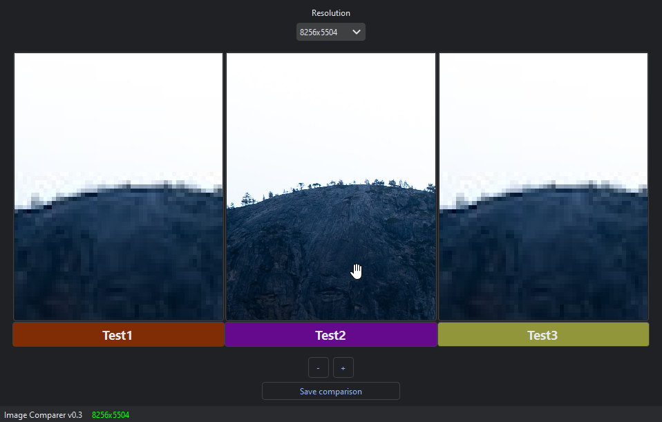

# Image Comparator

The Image Comparison Tool is a simple application that enables you to compare two images side by side. This tool allows you to scroll through images in both horizontal and vertical directions and zoom in to closely examine the details of each image.



## Features

- **Image Comparison:** View and compare two images simultaneously.
- **Scrolling:** Scroll through both images independently in both horizontal and vertical directions.
- **Zoom:** Zoom in and out to get a closer look at specific areas in the images.
- **Easy-to-Use Interface:** User-friendly interface for seamless navigation and comparison.

## Getting Started

### Prerequisites

Make sure you have the following prerequisites installed:

- Python 3.x
- PySide6

### Installation

1. Clone the repository:

   ```shell
   git clone https://github.com/hawier-dev/image_comparator.git
   ```

2. Navigate to the project directory:

   ```shell
   cd image_comparator
   ```

3. Run the application:

   ```shell
   python main.py
   ```

